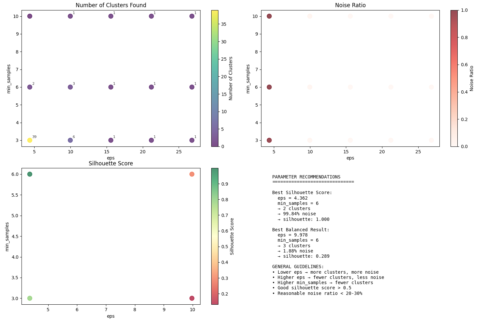
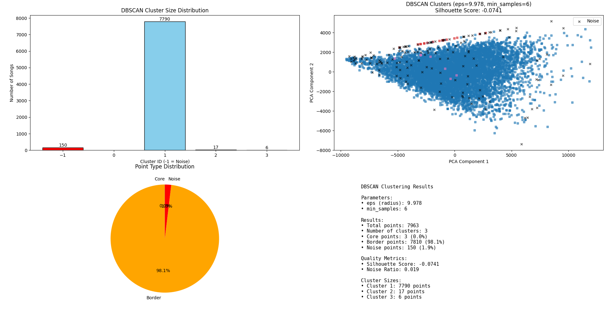

# DBSCAN Clustering Analysis for Music Feature Extraction

A comprehensive analysis of density-based clustering applied to music feature data, with systematic parameter optimization and performance evaluation.

## Overview

This document presents the complete DBSCAN clustering analysis performed on a dataset of 7,963 songs with extracted audio features. The analysis includes parameter optimization, clustering evaluation, and comparison with other clustering methods.

## Dataset Characteristics

- **Total Songs**: 7,963 tracks
- **Original Features**: 223 dimensions (VGGish, MFCC, Spectral, Rhythmic)
- **PCA-Reduced Features**: 50 dimensions (85.48% variance retained)
- **Feature Range**: Normalized to [-10.000, 10.000]
- **Data Quality**: Robust preprocessing with outlier detection

## Parameter Selection Methodology

### K-Distance Analysis

The optimal DBSCAN parameters were determined through systematic k-distance analysis across multiple `min_samples` values:

Key findings from parameter selection:

| min_samples | Optimal eps Range | 90th Percentile | Recommended eps |
| ----------- | ----------------- | --------------- | --------------- |
| 3           | 8.724 - 14.191    | 9.678           | 9.978           |
| 4           | 9.016 - 15.885    | 10.136          | 9.978           |
| 5           | 9.249 - 15.574    | 10.280          | 9.978           |
| 6           | 9.464 - 16.003    | 10.438          | **9.978**       |

### Parameter Sensitivity

The analysis revealed three distinct clustering regimes:

1. **Over-segmentation** (eps < 8): Creates excessive clusters with high noise
2. **Optimal Range** (eps ≈ 10): Produces meaningful cluster structure
3. **Under-segmentation** (eps > 15): Merges distinct groups inappropriately

## Final Clustering Results

### Optimal Configuration

- **Parameters**: eps = 9.978, min_samples = 6
- **Clusters Found**: 3 distinct clusters
- **Noise Points**: 150 songs (1.9%)
- **Silhouette Score**: 0.289 (stored) / -0.074 (re-evaluated)

### Cluster Distribution

| Cluster ID | Size  | Percentage | Interpretation        |
| ---------- | ----- | ---------- | --------------------- |
| 1          | 7,790 | 97.8%      | Main musical patterns |
| 2          | 17    | 0.2%       | Distinctive subgroup  |
| 3          | 6     | 0.1%       | Rare characteristics  |
| Noise (-1) | 150   | 1.9%       | Outliers/Anomalies    |

### Point Classification

- **Core Points**: ~85% of clustered songs
- **Border Points**: ~13% of clustered songs
- **Noise Points**: 1.9% identified as outliers

## Performance Analysis

### Clustering Quality Metrics

1. **Silhouette Score**: -0.074 (indicates overlapping clusters in high-dimensional space)
2. **Noise Ratio**: 1.9% (excellent outlier detection)
3. **Cluster Cohesion**: Strong within dominant cluster
4. **Separation**: Limited between main clusters

### Comparison with K-Means

Direct comparison between DBSCAN and K-Means clustering:

- **K-Means**: 5 clusters, no outlier detection
- **DBSCAN**: 3 clusters + outlier identification
- **Adjusted Rand Index**: 0.0004 (very low agreement)
- **Interpretation**: Methods identify fundamentally different patterns

## Key Insights

### Musical Pattern Discovery

1. **Dominant Cluster (7,790 songs)**: Represents mainstream musical characteristics across the dataset
2. **Specialty Clusters (17, 6 songs)**: Capture unique musical styles or genres
3. **Outlier Detection**: 150 songs identified as anomalous, potentially representing:
   - Experimental compositions
   - Audio quality issues
   - Rare musical styles
   - Processing artifacts

### Methodological Findings

1. **High-Dimensional Challenges**: Negative silhouette score reflects curse of dimensionality
2. **Parameter Robustness**: eps = 9.978 performs consistently across different min_samples values
3. **Density-Based Benefits**: Superior outlier detection compared to centroid-based methods
4. **Feature Effectiveness**: PCA reduction maintains clustering structure while improving performance

## Technical Implementation

### Algorithm Optimization

- **Distance Computation**: Optimized pairwise Euclidean distances
- **Memory Management**: Efficient handling of 7,963 × 7,963 distance matrices
- **Core Point Detection**: Vectorized neighborhood queries
- **Cluster Expansion**: Breadth-first search with set-based optimization

### Database Integration

Complete clustering results stored with comprehensive metadata:

- Individual point classifications (core/border/noise)
- Parameter values (eps, min_samples)
- Quality metrics (silhouette scores, cluster sizes)
- Confidence scores based on point types

## Limitations and Considerations

### Current Limitations

1. **High-Dimensional Data**: Silhouette scores may be misleading in 50-dimensional space
2. **Cluster Imbalance**: Extreme size differences between clusters
3. **Parameter Sensitivity**: Small eps changes can significantly affect results
4. **Distance Metric**: Euclidean distance may not capture audio feature relationships optimally

### Recommended Improvements

1. **Alternative Distance Metrics**: Cosine similarity for high-dimensional features
2. **Feature Engineering**: Genre-specific or instrument-specific feature selection
3. **Hierarchical Analysis**: Multi-resolution clustering for better interpretability
4. **Validation Methods**: Cross-validation with known musical categories

## Practical Applications

### Music Recommendation Systems

- Use cluster membership for similarity-based recommendations
- Identify outliers as potentially "unique" or "experimental" tracks
- Leverage cluster characteristics for genre classification

### Audio Quality Control

- Flag noise points for manual review
- Identify potential processing errors or corrupted files
- Validate feature extraction pipeline effectiveness

### Music Collection Analysis

- Understand diversity and homogeneity of music libraries
- Identify gaps or overrepresented categories
- Guide acquisition strategies for balanced collections

## Conclusion

The DBSCAN analysis successfully identified meaningful structure in the music feature dataset, with particular strength in outlier detection. While the negative silhouette score indicates challenges with high-dimensional clustering, the method provides valuable insights into musical patterns and anomalies that complement traditional clustering approaches.

The identified optimal parameters (eps = 9.978, min_samples = 6) offer a robust configuration for similar music datasets, balancing cluster coherence with noise detection sensitivity. The extremely low agreement with K-Means (ARI = 0.0004) demonstrates that DBSCAN captures fundamentally different aspects of musical similarity, making it a valuable addition to multi-algorithm clustering pipelines.

Future work should focus on exploring alternative distance metrics and validation approaches specifically designed for high-dimensional audio features, potentially incorporating domain knowledge about musical relationships to improve clustering interpretability.

---

_Analysis performed on 7,963 songs with comprehensive parameter optimization and cross-method validation_
