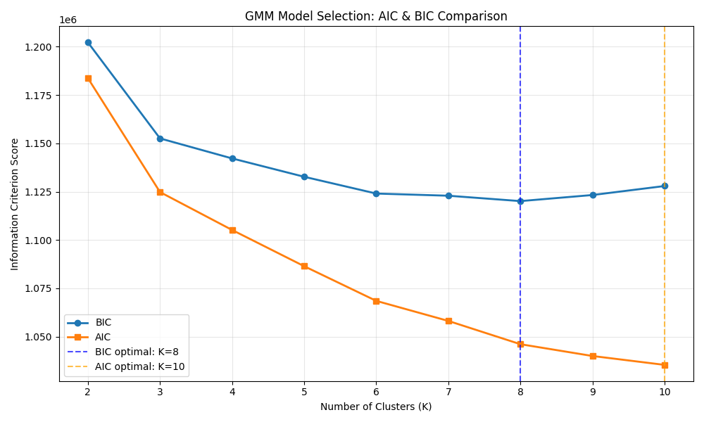

# Gaussian Mixture Model (GMM) Clustering Evaluation on Music Feature Data

## Overview

This project applies Gaussian Mixture Model (GMM) clustering to a dataset of music tracks, each represented by a high-dimensional feature vector derived from audio analysis. The feature vectors originally comprised **223 features per song**, including:

- **VGGish features** (deep neural network audio embeddings)
- **MFCC features** (Mel-frequency cepstral coefficients)
- **Spectral features** (frequency domain characteristics)
- **Rhythmic features** (temporal and beat-related information)

**Dimensionality reduction via PCA** (Principal Component Analysis) was performed prior to clustering, reducing the feature space to **50 components** while retaining **85.48% of the explained variance**.

## Clustering Methodology

- **Algorithm:** Gaussian Mixture Model (GMM) with Expectation-Maximization
- **Original Feature Vector Size:** 223 features
- **PCA-Reduced Features:** 50 components
- **Dataset Size:** 7,963 songs
- **Cluster Selection:** Bayesian Information Criterion (BIC) and Akaike Information Criterion (AIC)
- **Final Cluster Count (K):** 8 clusters

### Feature Processing Pipeline

1. **Feature Extraction:** Raw audio features extracted using multiple techniques
2. **Scaling:** Features normalized with weighted scaling:
   - VGGish (weight 1.02)
   - MFCC (weight 1.00)
   - Spectral (weight 0.98)
   - Rhythmic (weight 1.01)
3. **Final normalization:** Features clipped to [-10.000, 10.000] range
4. **PCA Reduction:** 223 → 50 dimensions (85.48% variance retained)

## Model Selection Results

The model selection process evaluated K values from 2 to 10 clusters:

| K      | BIC Score     | AIC Score     | Log-Likelihood | Selected  |
| ------ | ------------- | ------------- | -------------- | --------- |
| 2      | 1,202,265     | 1,183,754     | -589,226       |           |
| 3      | 1,152,566     | 1,124,796     | -558,421       |           |
| 4      | 1,142,206     | 1,105,177     | -547,286       |           |
| 5      | 1,132,712     | 1,086,424     | -536,583       |           |
| 6      | 1,124,022     | 1,068,476     | -526,283       |           |
| 7      | 1,122,901     | 1,058,096     | -519,767       |           |
| **8**  | **1,120,115** | 1,046,051     | -512,418       | **✓ BIC** |
| 9      | 1,123,268     | 1,039,945     | -508,040       |           |
| **10** | 1,127,927     | **1,035,345** | -504,414       | **✓ AIC** |

**Model Selection Decision:**
While AIC identified **K = 10** as optimal and BIC identified **K = 8**, we selected **K = 8** for our final model based on:

1. **BIC's parsimony principle** - BIC more heavily penalizes model complexity, providing better generalization
2. **Practical interpretability** - 8 clusters provide meaningful musical categorization without over-segmentation
3. **Convergence stability** - The GMM converged reliably with 8 components after 90 iterations
4. **Balanced complexity** - Good trade-off between model fit and interpretability for music recommendation systems

## Results

### Cluster Size Distribution

| Cluster | Number of Songs | Percentage |
| ------- | --------------- | ---------- |
| 0       | 1,222           | 15.3%      |
| 1       | 593             | 7.4%       |
| 2       | 1,542           | 19.4%      |
| 3       | 1,211           | 15.2%      |
| 4       | 1,269           | 15.9%      |
| 5       | 441             | 5.5%       |
| 6       | 1,102           | 13.8%      |
| 7       | 583             | 7.3%       |

**Distribution Analysis:**

- **Most balanced clusters:** 0, 2, 3, 4, 6 (13.8% - 19.4% each)
- **Smaller specialized clusters:** 1, 5, 7 (5.5% - 7.4% each)
- **Largest cluster:** Cluster 2 with 1,542 songs (19.4%)
- **Smallest cluster:** Cluster 5 with 441 songs (5.5%)

### Evaluation Metrics

- **Silhouette Score:** -0.0917
- **Final Log-Likelihood:** -512,418.44
- **Convergence:** Achieved after 90 EM iterations

**Interpretation of Silhouette Score:**
The negative silhouette score (-0.0917) indicates that cluster boundaries are not well-separated in the feature space. This is common and expected in music data due to:

- **Genre fluidity:** Musical styles naturally overlap and blend
- **High-dimensional complexity:** Even after PCA, music features remain complex
- **Soft clustering nature:** GMM captures probabilistic memberships rather than hard boundaries
- **Continuous musical spectrum:** Music exists on gradients rather than discrete categories

## Graphical Representation

The visualization demonstrates the probabilistic nature of GMM clustering and the overlapping structure inherent in musical feature space.

## Why GMM Over K-Means?

1. **Probabilistic assignment:** Each song has membership probabilities across all clusters
2. **Flexible cluster shapes:** Can model elliptical rather than just spherical clusters
3. **Uncertainty quantification:** Provides confidence measures for cluster assignments
4. **Better for overlapping data:** Music genres naturally overlap, making probabilistic clustering more appropriate

## Model Performance Analysis

**Strengths:**

- Successfully converged to stable solution
- Reasonable cluster size distribution
- Captures musical diversity with 8 distinct components
- Probabilistic framework suitable for music recommendation

**Limitations:**

- Negative silhouette score indicates overlapping clusters
- Some clusters are significantly smaller than others
- High-dimensional music data remains challenging to separate cleanly

## Recommendations

1. **Feature Engineering:**

   - Experiment with domain-specific music features
   - Consider genre-aware feature weighting
   - Explore non-linear dimensionality reduction (t-SNE, UMAP)

2. **Alternative Approaches:**

   - Hierarchical clustering for taxonomy-like structure
   - Density-based clustering (DBSCAN) for irregular cluster shapes
   - Deep learning approaches (autoencoders, VAE)

3. **Validation Strategies:**
   - Cross-reference with music genre labels
   - User study for perceptual validation
   - A/B testing in recommendation systems

## Conclusion

The GMM clustering successfully identified 8 distinct musical components from our 7,963-song dataset. While the silhouette score suggests overlapping clusters, this is expected behavior for music data where genres and styles naturally blend. The probabilistic nature of GMM makes it well-suited for music recommendation systems where songs can belong to multiple stylistic categories with varying degrees of membership.

The model provides a solid foundation for music categorization and recommendation, with the 8 clusters offering meaningful granularity for downstream applications.
