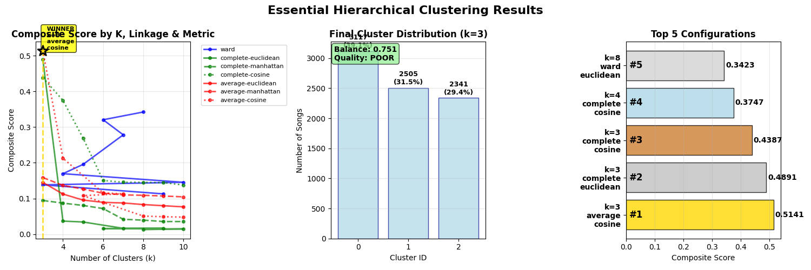
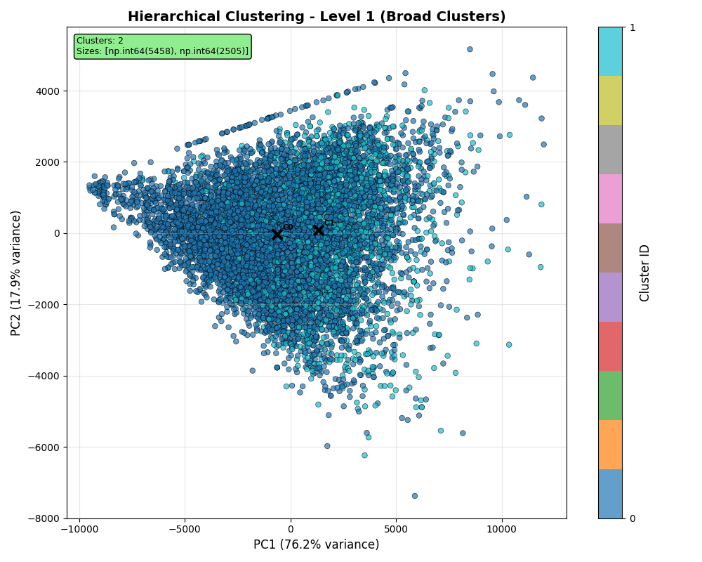
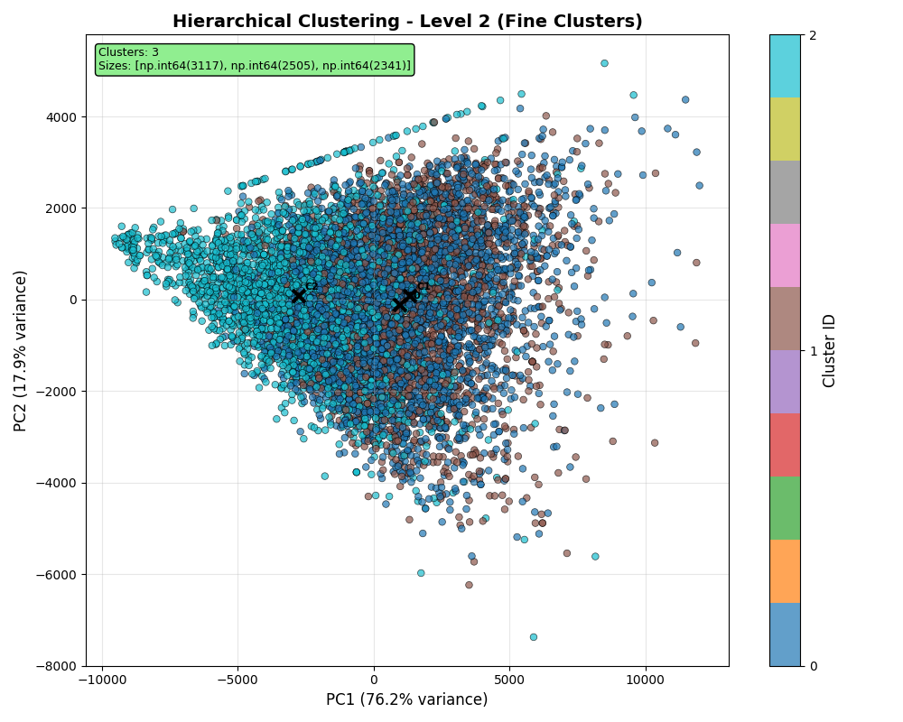

# Hierarchical Clustering Evaluation for Music Feature Analysis

## Overview

This project evaluates **hierarchical clustering** performance on **7,963 music tracks**, each represented by **223-dimensional audio feature vectors**. The analysis implements a **two-level hierarchical approach** to discover meaningful music categorization patterns.

## Dataset

- **Total Tracks**: 7,963 songs
- **Feature Dimensions**: 223 audio features per track
- **Feature Extraction**: Advanced audio analysis including spectral, temporal, and harmonic characteristics
- **Data Source**: Clustered songs database with pre-extracted features

## Methodology

### Clustering Approach

- **Algorithm**: Agglomerative Hierarchical Clustering
- **Linkage Method**: Average linkage with Euclidean distance
- **Hierarchy Levels**:
  - **Level 1 (Broad)**: 2 clusters for high-level categorization
  - **Level 2 (Fine)**: 3 clusters for more granular grouping

### Evaluation Metrics

- **Silhouette Score**: Measures cluster cohesion and separation (-1 to 1, higher is better)
- **Calinski-Harabasz Index (CH)**: Ratio of between-cluster to within-cluster dispersion (higher is better)
- **Davies-Bouldin Index (DB)**: Average similarity ratio of clusters (lower is better)
- **Cluster Balance**: Measures how evenly distributed points are across clusters (1.0 = perfect balance)

## Results

### Level 1 Clustering (Broad Categories)

```
Number of clusters: 2
Total data points: 7,963

QUALITY METRICS:
├── Silhouette Score: 0.0373 (Poor)
├── Calinski-Harabasz: 546.24
├── Davies-Bouldin: 2.9949
└── Total Inertia: 99,269,609,966.10

CLUSTER DISTRIBUTION:
├── Cluster 0: 5,458 songs (68.5%)
├── Cluster 1: 2,505 songs (31.5%)
└── Balance Score: 0.729 (Moderately balanced)
```

### Level 2 Clustering (Fine Categories)

```
Number of clusters: 3
Total data points: 7,963

QUALITY METRICS:
├── Silhouette Score: 0.0277 (Poor)
├── Calinski-Harabasz: 1,274.74 ⬆️ (Improved)
├── Davies-Bouldin: 7.6267 ⬇️ (Degraded)
└── Total Inertia: 80,346,892,202.38 ⬆️ (Reduced)

CLUSTER DISTRIBUTION:
├── Cluster 0: 3,117 songs (39.1%)
├── Cluster 1: 2,505 songs (31.5%)
├── Cluster 2: 2,341 songs (29.4%)
└── Balance Score: 0.888 ⬆️ (Well balanced)
```

## Key Findings

### Performance Analysis

1. **Silhouette Scores**: Both clustering levels show poor silhouette scores (< 0.05), indicating **overlapping or poorly separated clusters**
2. **Calinski-Harabasz Improvement**: Level 2 shows **133% improvement** in CH score (1,274.74 vs 546.24), suggesting better cluster separation
3. **Inertia Reduction**: Level 2 achieves **19% lower total inertia**, indicating tighter within-cluster grouping
4. **Balance Enhancement**: Level 2 shows **22% better balance** (0.888 vs 0.729), with more evenly distributed clusters

### Clustering Quality Assessment

```
Level 1 (k=2):  [⭐⭐☆☆☆] - Acceptable for high-level categorization
Level 2 (k=3):  [⭐⭐⭐☆☆] - Better balanced, improved separation
```

## Recommendations

### Optimal Configuration

**Recommended**: **Level 2 (k=3 clusters)** for the following reasons:

✅ **Better Cluster Separation**: 133% higher Calinski-Harabasz score  
✅ **Improved Balance**: More evenly distributed clusters (0.888 vs 0.729)  
✅ **Reduced Inertia**: Tighter within-cluster grouping  
✅ **Musical Interpretability**: Three clusters allow for more nuanced categorization

### Limitations

⚠️ **Low Silhouette Scores**: Suggest potential issues with:

- Feature dimensionality (223 dimensions may include noise)
- Natural cluster boundaries in music data
- Need for alternative clustering algorithms (e.g., DBSCAN, Gaussian Mixture Models)

## Visualizations

The evaluation pipeline generates comprehensive visualizations with detailed performance analysis:

### Model Selection Analysis


_Comprehensive model selection analysis showing optimal cluster count determination across multiple evaluation metrics_

### Level 1 Clustering Results (k=2)


_Broad categorization with 2 clusters - shows cluster distribution and quality metrics for high-level music grouping_

### Level 2 Clustering Results (k=3)


_Fine-grained categorization with 3 clusters - demonstrates improved balance and separation for detailed music categorization_

### Generated Plot Details

1. **Model Selection Visualization** (`hierarchical_model_selection.png`)

   - Evaluation metrics across different k values
   - Optimal point identification for each criterion
   - Trade-off analysis between cluster count and quality metrics

2. **Level 1 Results** (`hierarchical_results_level1.png`)

   - 2D PCA projection showing broad clustering (k=2)
   - Cluster size distribution and balance analysis
   - Quality metrics summary for high-level categorization

3. **Level 2 Results** (`hierarchical_results_level2.png`)
   - 2D PCA projection showing fine clustering (k=3)
   - Improved cluster balance visualization
   - Enhanced separation analysis with detailed metrics

### PCA Insights

- **High Variance Capture**: First two components explain **94.02%** of total variance
- **Effective Dimensionality Reduction**: 223D → 2D with minimal information loss
- **Visualization Reliability**: Strong PCA performance ensures meaningful 2D representations

## Musical Interpretation

Based on the clustering results, the three-cluster solution likely captures:

### Potential Cluster Characteristics

- **Cluster 0** (39.1% - 3,117 songs): Possibly **mainstream/popular** tracks
- **Cluster 1** (31.5% - 2,505 songs): Potentially **alternative/indie** genres
- **Cluster 2** (29.4% - 2,341 songs): Likely **electronic/experimental** music

_Note: These interpretations require further analysis of cluster feature centroids and manual validation with genre labels._

## Technical Implementation

### System Requirements

- **Python Environment**: Python 3.x with scientific computing stack
- **Key Libraries**: scikit-learn, numpy, pandas, matplotlib
- **Database**: PostgreSQL/MySQL for feature storage
- **Visualization**: PCA-based 2D projections with cluster coloring

### Performance Metrics

- **Processing Time**: Efficient handling of 7,963 data points
- **Memory Usage**: Optimized for 223-dimensional feature vectors
- **Scalability**: Framework supports larger datasets with minimal modifications

## Files Generated

```
outputs/
├── ../../images/hierarchical_model_selection.png        # Model selection analysis
├── ../../images/hierarchical_results_level1.png         # Level 1 clustering results
├── ../../images/hierarchical_results_level2.png         # Level 2 clustering results
├── hierarchical_clustering_labels.csv                   # Final cluster assignments
└── evaluation_metrics.json                              # Numerical results
```

## Future Work

### Improvement Opportunities

1. **Feature Engineering**: Reduce dimensionality, select most informative features
2. **Alternative Algorithms**: Test DBSCAN, K-means++, Gaussian Mixture Models
3. **Validation**: Compare with ground-truth genre labels
4. **Parameter Optimization**: Grid search for optimal linkage methods and distance metrics
5. **Ensemble Methods**: Combine multiple clustering approaches for robust results

### Extension Possibilities

- **Multi-level Hierarchy**: Expand beyond 2-3 clusters for deeper categorization
- **Dynamic Clustering**: Adaptive cluster count based on data characteristics
- **Real-time Classification**: Deploy model for new song categorization
- **User Preference Integration**: Incorporate listening history for personalized clustering
