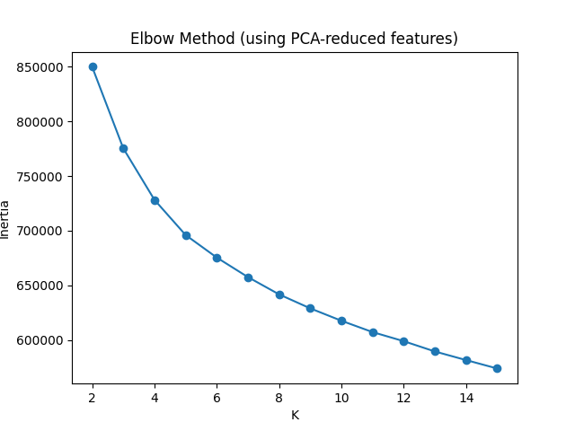
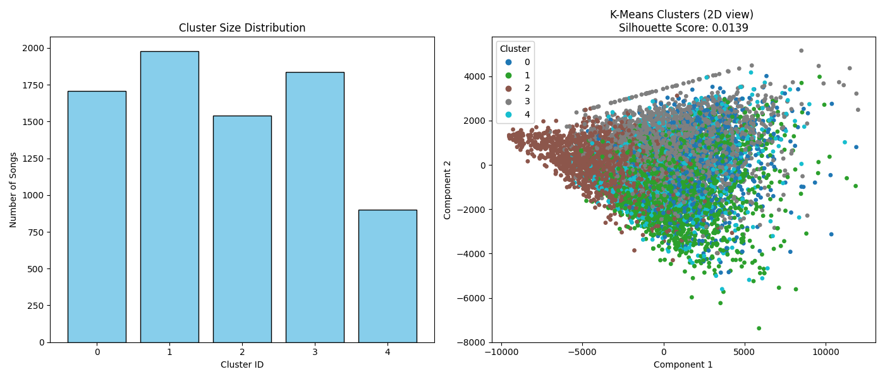

# K-Means Clustering Evaluation on Music Feature Data

## Overview

This project applies K-Means clustering to a dataset of **7,963 music tracks**, each represented by a high-dimensional feature vector derived from audio analysis and metadata. The feature vectors originally comprised **223 features per song**.

**Dimensionality reduction via PCA** (Principal Component Analysis) was performed prior to clustering to reduce dimensionality and retain the most informative components.

---

## Clustering Methodology

- **Algorithm:** K-Means
- **Feature Vector Size:** 223 features (reduced with PCA)
- **Cluster Count (k):** Selected using the Elbow Method
- **Evaluation Metrics:**
  - **Silhouette Score**
  - **Cluster Size Distribution**

---

## Results

### 1. Cluster Size Distribution

| Cluster | Number of Songs |
| ------- | --------------: |
| 0       |            1707 |
| 1       |            1977 |
| 2       |            1541 |
| 3       |            1836 |
| 4       |             902 |

> Note: Clusters are somewhat imbalanced. For example, cluster 4 is smaller than others, while cluster 1 is the largest.

---

### 2. Silhouette Score

- **Silhouette Score:** `0.0139`

The silhouette score ranges from -1 to 1:

- **Close to 1:** Well-separated clusters
- **Around 0:** Overlapping or poorly defined clusters (like in this case)

---

### 3. Graphical Representations

#### K-Means Elbow Plot

#### Cluster Visualization (Optional)

> These visualizations show that even after PCA, music features overlap significantly, explaining the low silhouette score.

---

## Why Are the Scores Low?

1. **Complexity of Music Data:** Musical characteristics often overlap, making distinct clusters hard to define.
2. **Feature Quality:** Not all audio features equally capture perceptual similarity; some may introduce noise.
3. **K-Means Limitations:** Assumes spherical, equally-sized clusters, which may not match real music data structure.
4. **Overlapping Musical Properties:** Genres, moods, and styles often blur together.

---

## Recommendations

- Try **alternative clustering algorithms**: Gaussian Mixture Models (GMM), DBSCAN, Agglomerative Clustering.
- Refine **feature engineering/selection** to focus on perceptually meaningful features.
- Visualize clusters using **2D/3D PCA or t-SNE** for interpretability.
- Experiment with different **numbers of PCA components** and **values of k**.

---

## Conclusion

K-Means struggles to produce well-separated clusters on this high-dimensional, complex music dataset. The low silhouette score indicates overlapping clusters, common in music data. **Further exploration with other clustering methods and feature engineering is recommended.**
